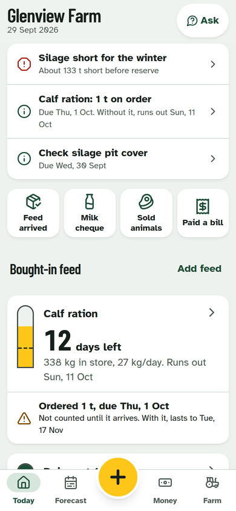
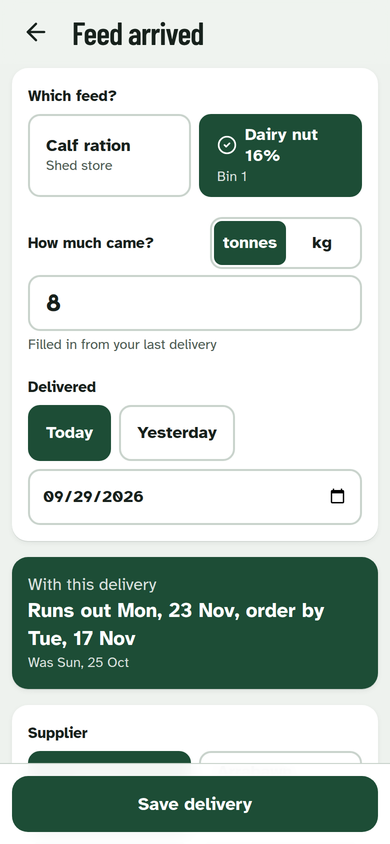
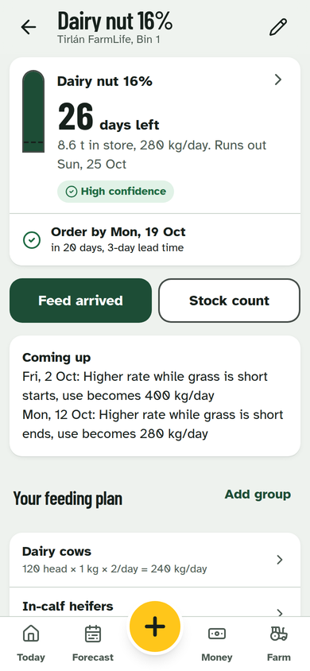
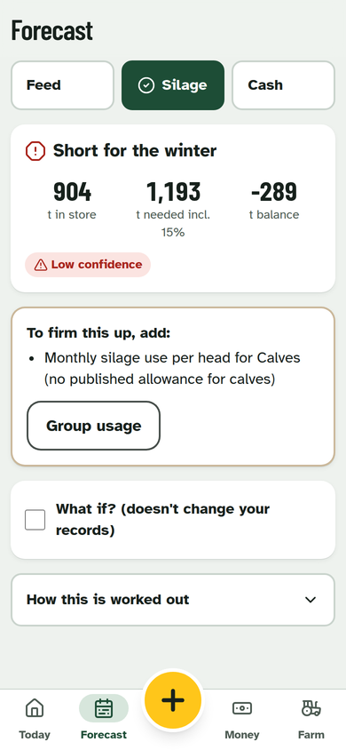
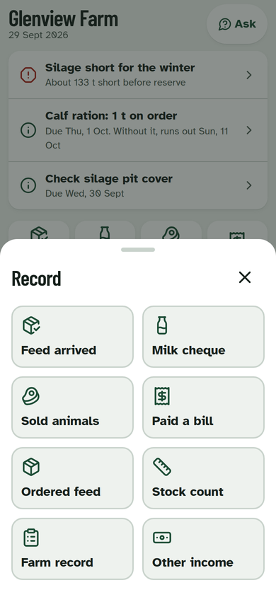

# Agri-It

Irish farm intelligence for day-to-day decisions: purchased feed run-out and reorder dates, winter silage cover, cash flow, farm records and a year-end pack for the accountant.

**Record something once. Agri-It uses it everywhere it is relevant.** A feed delivery updates stock, run-out, feed cost, cash flow, supplier history and records in one step.

Built from the *Agri-It MVP Overview* (September 2026). Mobile-first, installable, and works offline.

| Today | Feed arrived | Feed detail | Silage | Record |
| --- | --- | --- | --- | --- |
|  |  |  |  |  |

---

## Run it locally

### Prerequisites

- **Node.js 20+** (22 recommended, see `.nvmrc`)
- **Docker Desktop** (or Podman), running. The Supabase CLI uses it for the local database, auth and storage.

The Supabase CLI is installed as a dev dependency, so there is nothing else to install globally.

### Steps

```bash
npm install
npm run supabase:start      # first run pulls Docker images, takes a few minutes
```

When it finishes it prints an `API URL` and an `anon key`. Then:

```bash
cp .env.example .env.local  # paste the anon key into VITE_SUPABASE_ANON_KEY
npm run dev
```

Open http://localhost:5173 and tap **Open the demo farm**, or sign in with:

| Email | Password |
| --- | --- |
| `demo@agri-it.local` | `agri-it-demo` |

The demo farm (Glenview Farm, Co. Tipperary) has groups, two feeds, an open order, a temporary feeding plan, silage, eight months of money and some records. Dates are relative to the day you seed, so the demo never goes stale. You can also create a fresh account to walk through onboarding: email confirmation is off locally.

### Useful commands

| Command | What it does |
| --- | --- |
| `npm run supabase:reset` | Rebuild the database from migrations and reseed the demo farm |
| `npm run supabase:status` | Show local URLs and keys again |
| `npm run supabase:stop` | Stop the local stack |
| `npm test` | Unit tests for the forecast engines |
| `npm run typecheck` / `npm run build` | Type-check / production build with service worker |

Supabase Studio (table browser, SQL editor) runs at http://127.0.0.1:54323 while the stack is up.

### Try it on your phone

```bash
npm run dev -- --host
```

Open the `Network` URL on a phone on the same Wi-Fi. For the phone to reach the database, set `VITE_SUPABASE_URL` in `.env.local` to your computer's LAN IP (for example `http://192.168.1.20:54321`) instead of `127.0.0.1`. Voice dictation and "install to home screen" need HTTPS or localhost, so test those on the deployed version.

### Demo build (no database)

```bash
npm run build:demo        # writes dist-demo/index.html, one self-contained file
npm run preview:demo      # serve it locally
```

The demo runs the real screens and forecast engines against the Glenview Farm sample data held in the browser, through an in-browser stand-in for Supabase (`src/lib/demo/`). Nothing reaches a server, and a Reset button restores the sample farm. Use it to show the app without any backend; CSV export and print are switched off in this mode.

---

## Push to GitHub

Create an empty repo on GitHub (no README or .gitignore), then from the unzipped folder:

```bash
git init -b main
git add -A
git commit -m "Agri-It MVP"
git remote add origin https://github.com/<you>/agri-it.git
git push -u origin main
```

`.env.local` is git-ignored. The included GitHub Actions workflow type-checks, tests and builds the app, and applies every migration plus the seed to a real Supabase database on each push.

### Deploy (when ready)

1. Create a project at supabase.com, then `npx supabase link --project-ref <ref>` and `npx supabase db push`.
2. **Don't run `seed.sql` in production.** It creates the demo login. Load the reference data (evidence sources, forage benchmarks and supplier directory) from the top half of the file only.
3. Host the `dist/` build on Vercel, Netlify or Cloudflare Pages with `VITE_SUPABASE_URL` and `VITE_SUPABASE_ANON_KEY` set. Add the site URL to Supabase Auth redirect URLs and turn email confirmations on.

---

## How it's built

| Layer | Choice | Why |
| --- | --- | --- |
| App | React 18, TypeScript, Vite, Tailwind | Fast, typed, small |
| Data | Supabase: Postgres, Auth, Storage, row-level security | One farm's data is invisible to other users at the database level |
| Offline | PWA service worker, persisted query cache, write outbox | Yards and sheds have poor signal |
| Forecasts | Pure TypeScript functions with unit tests | Transparent, testable, same result online or offline |

```
supabase/
  migrations/                     schema; RLS, storage and transactional functions
  seed.sql                        evidence sources, Teagasc allowances, supplier directory, demo farm
src/
  lib/forecast/feed.ts            run-out, reorder, order-by, confidence, predicted vs counted
  lib/forecast/forage.ts          winter silage budget with evidence hierarchy
  lib/forecast/money.ts           cash position, 90-day view, budget vs actual, year-end pack
  lib/suppliers.ts                contact routing: My rep → branch → central, never a guessed rep
  lib/ask.ts                      Ask Agri-It: rule-based answers from farm data only
  lib/offline/outbox.ts           queued writes with idempotent replay
  lib/data/                       farm bundle query, derived forecasts, Today priorities, snapshots
  components/                     UI kit, feed gauge, app shell
  pages/                          screens
```

### Spec coverage

| Spec | Where |
| --- | --- |
| Feed delivery with ordered vs delivered stock, €/t ↔ total, docket photo | `DeliveryForm`, `OrderForm`, `record_feed_delivery()` |
| Feed shared across groups at different rates | `FeedingRuleForm`, `feeding_rules` |
| Recalculates on delivery, count, head count or rule change | Forecast is derived live from the ledger |
| Temporary feeding plans | Replace a group's normal rate for a date window, then revert |
| Predicted vs actual, never silently changing the farmer's rate | `countVariances()`, shown on the feed screen |
| Confidence: High, Medium, Low, Scenario, with reasons | `forecastFeed()`, `forecastForage()` |
| Lead time, price and rep never invented | No lead time means no order-by date; no named reps seeded |
| Forage: measured stores beat acreage; farm usage beats Teagasc allowances | `forage.ts` |
| Cash: known and assumed kept separate | `cashForecast90()` |
| Year-end pack labelled as management summary, with missing-data checklist, CSV and print | `YearEnd` |
| Forecast governance: inputs, rule version and timestamp stored | `forecast_snapshots`, written whenever inputs change |
| Supplier directory with verification dates and "Set my rep" | `Suppliers`, `SupplierDetail` |

---

## UX decisions, and why

Designed for someone standing in a yard with gloves, glare, a patchy signal and a minute to spare. These patterns come from agritech UX research and from how successful Irish farm apps work:

- **Answer first.** Today leads with what needs doing: order feed, silage short, cash pressure, jobs due. Formulas and assumptions sit one tap deeper under "How this is worked out".
- **Thumb reach.** The bottom tab bar has a central hi-vis **Record** button that opens the farmer intents from spec section 8 as large tiles. Save buttons are pinned to the bottom of the screen.
- **Big targets, little typing.** Touch targets are at least 56px (above Material's 48dp minimum). Forms use −/+ steppers, Today/Yesterday date chips, numeric keypads and tap-to-choose options instead of dropdowns, plus voice dictation for notes. Forms prefill from the last entry: the last quantity, price, supplier and milk processor.
- **Readable in sunlight.** Near-black on white, an Atkinson Hyperlegible body font designed for legibility, and a **Sunlight mode** in Settings. Status is always shown with an icon and words, never by colour alone.
- **Undo instead of "Are you sure?"** Saving is instant. A toast offers Undo for about seven seconds.
- **Offline-first.** Farm data is cached on the phone. Writes made with no signal are queued, shown in a calm status pill, and sent automatically when signal returns. Retries can't create duplicates, because every write carries a client-generated id.
- **See the effect before saving.** Entering a delivery shows the new run-out date live.
- **Trust through transparency.** Every forecast shows its confidence and what it was based on. Published figures show their source. Ask Agri-It refuses to prescribe feeding rates.

---

## Known limits and next steps (P1 from the spec)

- **Supplier numbers need re-verifying before launch.** They come from the MVP Overview and are stamped verified on 1 Sep 2026 to match it. Arrabawn Tipperary is deliberately left without a number until its merged directory is confirmed. Branch and territory data (`supplier_branches`) is empty until verified data is loaded.
- **OCR on dockets** (P1). Photos are stored and must be confirmed by the farmer; nothing is extracted yet.
- **Not yet built:** notifications, recurring income and costs, supplier price history, and inviting other people to a farm (the database supports members and advisors; the invite screen isn't built).
- **Data volume.** The app loads one farm's last ~2 years in a single cached query, which is simple and fast at family-farm scale. Move to paged queries if a farm has tens of thousands of rows.
- **Voice input** uses the browser's speech recognition (Chrome, Edge, Safari). It is hidden where it isn't supported.

## Sources

Forage allowances and financial-planning framing: Teagasc (S1, S3 to S6); Ifac Irish Farm Report 2026 (S2); supplier contact routes (S7 to S15). All are listed with URLs in `supabase/seed.sql` and the `evidence_sources` table.
